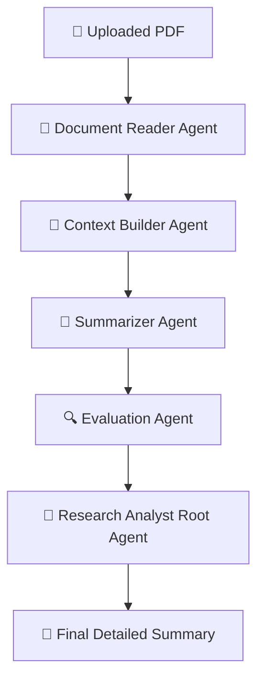

Here is a **clean, professional, copy-paste–ready README section**, rewritten to look polished and perfect for GitHub.
I kept **structure, clarity, formatting, emojis, and developer friendliness** exactly how high-quality OSS READMEs are written.


# **Research_Paper_Analyst**

### *A multi-agent system that reads research PDFs, builds context, searches the web, and generates a clear summary*


## 🚀 Overview

**Research_Paper_Analyst** is a **Google Colab–based multi-agent AI system** that automatically reads research papers and generates clean, structured summaries.

This system:

* Reads a research paper (PDF)
* Extracts meaningful sections (title, abstract, introduction, methods…)
* Builds a compressed context
* Generates a detailed, student-friendly explanation
* Evaluates correctness + clarity
* Returns a **final structured summary**

Built using:

* **Google Agent Development Kit (ADK)**
* **Gemini 2.0 Flash**
* **Multi-agent orchestration with tool-calling**

Perfect for **students, researchers, and developers** who want automated research understanding.


## 📦 Features

✔️ Multi-agent pipeline
✔️ PDF → Clean Markdown extraction
✔️ 500–700 word context builder
✔️ Human-readable paper summary
✔️ Automatic summary evaluation
✔️ Reproducible Google Colab notebook
✔️ Zero local setup (API key only)


## 🧠 Agentic Workflow

This project uses **five cooperating agents**:

### **1️⃣ Document Reader Agent**

Extracts clean Markdown sections from PDF (Title, Abstract, Methods, etc.)

### **2️⃣ Context Builder Agent**

Compresses extracted content into a **500–700 word contextual summary**.

### **3️⃣ Summarizer Agent**

Produces a clear explanation with:

* Problem
* Method
* Data
* Results
* Key takeaways

### **4️⃣ Evaluation Agent**

Grades the summary for:

* Clarity
* Correctness
* Completeness

### **5️⃣ Research Analyst Root Agent**

Coordinates all sub-agents, manages tool calls, and returns the **final summary**.


## 🔗 Agent Flow Diagram




## 🔧 How to Use (Google Colab)

### **Step 1 — Open the Colab Notebook**

Make a copy to your Drive.


### **Step 2 — Add Your API Key**

#### Option A (via Colab userdata)

```python
from google.colab import userdata
GOOGLE_API_KEY = userdata.get('GOOGLE_API_KEY')
os.environ['GOOGLE_API_KEY'] = GOOGLE_API_KEY
```

#### Option B (manual)

```python
import os
os.environ["GOOGLE_API_KEY"] = "your_api_key_here"
```


### **Step 3 — Upload Your PDF**

```python
from google.colab import files
uploaded = files.upload()  # select a PDF file
```


### **Step 4 — Extract Raw Text from PDF**

```python
from pypdf import PdfReader

def extract_pdf_text(path):
    reader = PdfReader(path)
    pages = [page.extract_text() or "" for page in reader.pages]
    return "\n\n".join(pages)

raw_text = extract_pdf_text(list(uploaded.keys())[0])
```


### **Step 5 — Run the Multi-Agent Pipeline**

```python
response = await runner.run_debug(raw_text)
```


## 📌 Output Format

The final structured summary includes:

* **Title**
* **Problem Statement**
* **Background & Motivation**
* **Method / Model Explanation**
* **Dataset Used**
* **Results**
* **Strengths**
* **Limitations**
* **Key Takeaways** (5–10 bullet points)
* **Conclusion**

**Summary Length:** 300–600 words.


## 📘 Example Summary (Snippet)

```
## Title
Retrieval-Enhanced Transformer (RET)

## Problem
Large language models struggle with...

## Method
RET introduces a frozen retriever connected to...
```


## 📜 Requirements

* Google Colab
* Python 3.10+
* Gemini API Key
* Dependencies auto-installed:

  * `google-adk`
  * `pypdf`


